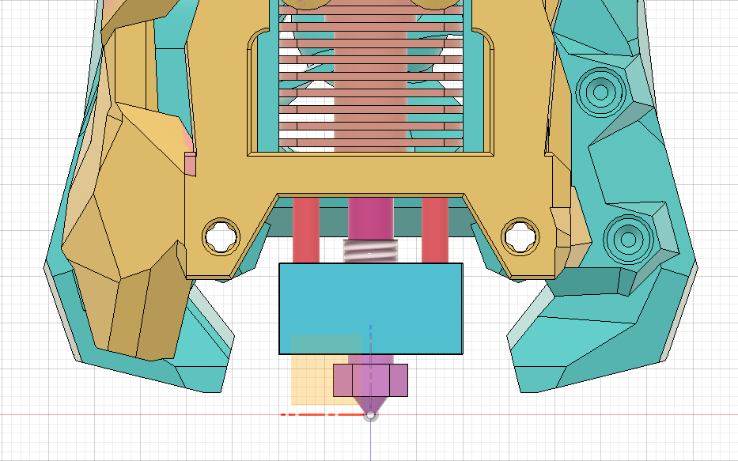
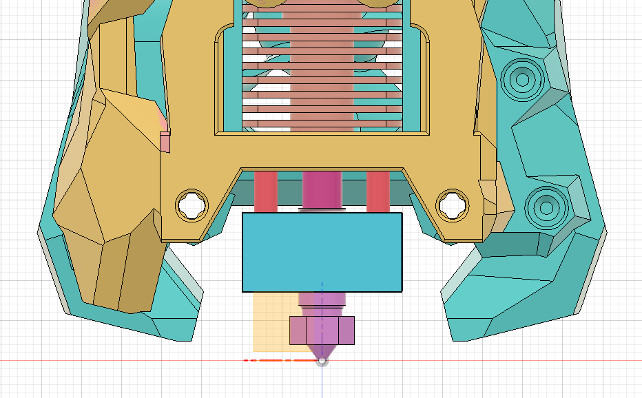
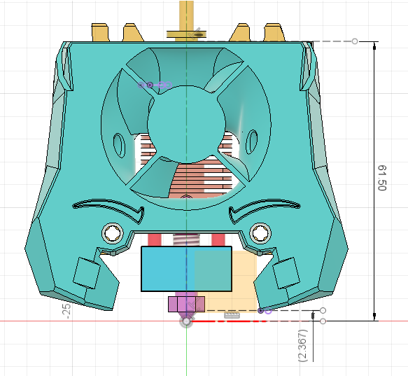
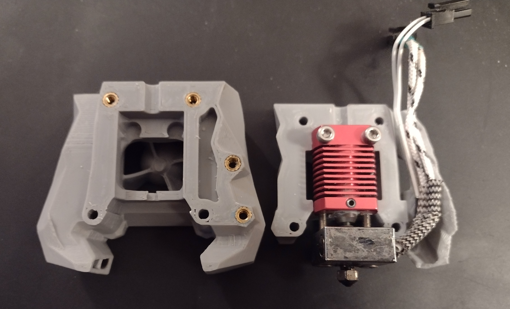
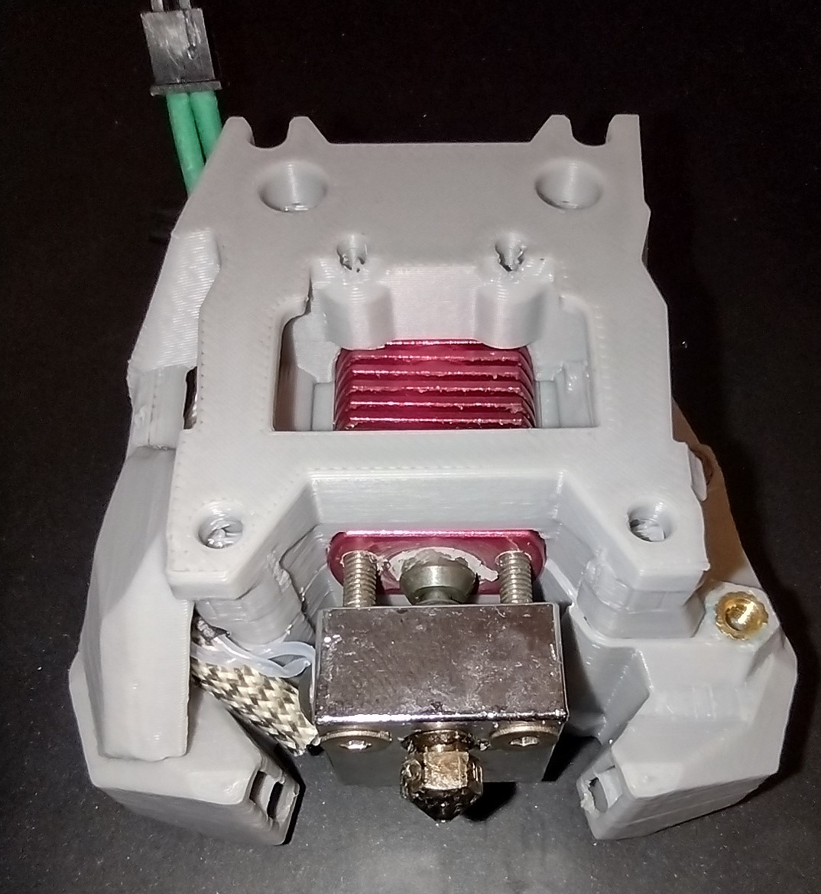
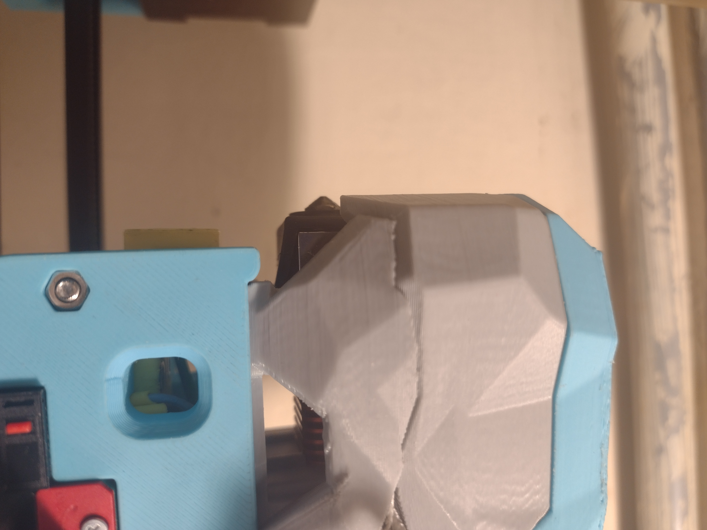

# Creality toolhead for stealthburner.

Not recommended but a potential pathway for e3->switchwire conversions. It's recommended to have an all metal heatbreak, both for printing ABS and for a higher volumetric flow rate. A good quality bimetallic heatbreak can outperform a stock V6. The pneumatic coupler version is intended for a lined heatbreak and complicates maintenance, only use it if you absolutely need it. I'm activley testing for the minimum viable product here.

I have a [version for AB-BN](https://github.com/strayr/voron-afterburner-ender3/tree/main/AA-BN-30_toolhead) of this that i have been using extensively.

## Use a V6 nozzle

The toolhead is optimised for v6/reprap nozzles, and this style of nozzle should be considered a requirement. There is less variance in length even amongst the cheap clones, but a genuine e3d or other high end nozzle is recommended. I have tested with genuine e3d 0.4mm nozzles, a reprap size Bondtech 0.6mm CHT nozzle and some 0.3 and 0.25mm clones of reasonable quality. 20mm stainless steel (or titanium) countersunk screws on the heater block are required, don't run without, this causes the heatbreak to telescope out of the heatsink in the event of a jam. Hardend steel conducts more heat and aluminium or brass screws absolutely will not work.

When assembled with a v6 nozzle you should have a setup that looks like this. There should be a gap between the hex head of the nozzle and the heater block, 1mm is plenty, you can go to 2mm if you feel the heatbreak needs more threads inside the heater block. 

The threads of the nozzle should not be visible.

## Nozzle position

The specified position for the nozzle is 61.5mm from the flat surface at the top of the toolhead. All other dimension are derived from this, and the distance between nozzle tip and duct may be different for other toolheads. On this toolhead the clearance distance is 2.37mnm from the tip of the nozzle to the lowest point on the duct as shown. You can check with an allen key set by setting the nozzle height to the bed and lifting the loolhead 0.1mm at a time until a 2.5mm allen key fits under the duct. It is to be expected that nozzles and heatbreaks might differ in length slightly so +/- 0.2mm should be within spec.

## Extra Materials
* 2x standard 5mm heatset inserts (two extra)
* 2x M3x18 SHCS
* 2x M3x20 countersunk stainless steel screws for the heater block

## Assemble as per photos and stealthburner manual

## Contact 
* [my github](https://github.com/strayr/strealthburner_creality_edition)
* strayr on voron discord 